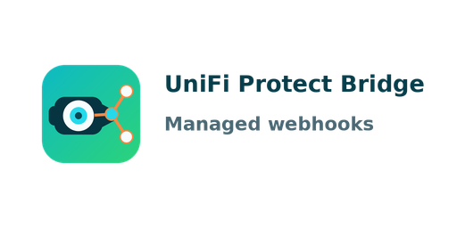
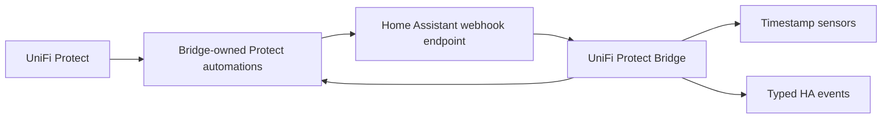

# UniFi Protect Bridge for Home Assistant

<p align="center">
  
</p>

<p align="center">
  <strong>Managed UniFi Protect webhooks, timestamp sensors, typed events, and recognized-face tracking for Home Assistant.</strong>
</p>

<p align="center">
  <a href="https://my.home-assistant.io/redirect/hacs_repository/?owner=Hovborg&repository=unifi-protect-bridge&category=integration">
    
  </a>
</p>

<p align="center">
  <a href="https://github.com/Hovborg/unifi-protect-bridge/releases/latest">
    
  </a>
  <a href="https://github.com/Hovborg/unifi-protect-bridge/actions/workflows/ci.yml">
    
  </a>
  <a href="https://github.com/Hovborg/unifi-protect-bridge/actions/workflows/hassfest.yml">
    
  </a>
  <a href="https://github.com/Hovborg/unifi-protect-bridge/actions/workflows/hacs.yml">
    
  </a>
</p>

<p align="center">
  
  
  
</p>

<p align="center">
  <a href="#quick-install">Quick Install</a> |
  <a href="#what-it-does">What It Does</a> |
  <a href="#recognized-faces">Recognized Faces</a> |
  <a href="#supported-detections">Detections</a> |
  <a href="#troubleshooting">Troubleshooting</a> |
  <a href="#optional-cli">Optional CLI</a>
</p>

UniFi Protect already has Alarm Manager and webhook actions, but maintaining a
separate webhook rule for every detection source gets messy quickly. UniFi
Protect Bridge turns that setup into a normal Home Assistant integration. It
discovers camera capabilities, creates bridge-owned Protect webhook automations,
receives local push events, and exposes the results as clean Home Assistant
entities and events.

> [!IMPORTANT]
> This repository is the Home Assistant custom integration. The CLI is optional,
> lives in a separate repository, and is not required for HACS installs.

## Highlights

| Area | What you get |
| --- | --- |
| Install | HACS custom repository, Home Assistant config flow, reconfigure, reauth, options flow |
| Protect side | Managed Alarm Manager webhook automations for supported detection sources |
| Home Assistant side | Timestamp sensors, typed events, diagnostics, services, and restore support |
| Face recognition | Known/unknown/person-of-interest events plus lazy named-face sensors when Protect sends names |
| Safety | Credentials, host details, webhook IDs, and webhook URLs are redacted from diagnostics |
| Compatibility | Custom integration domain `unifi_protect_bridge`, Home Assistant `2026.3.0+` |

## Quick Install

1. Open **HACS** in Home Assistant.
2. Open the top-right menu and choose **Custom repositories**.
3. Add `https://github.com/Hovborg/unifi-protect-bridge`.
4. Choose category **Integration**.
5. Open **UniFi Protect Bridge** in HACS and click **Download**.
6. Restart Home Assistant.
7. Go to **Settings -> Devices & services -> Add Integration**.
8. Search for **UniFi Protect Bridge**.

Direct HACS link:

```text
https://my.home-assistant.io/redirect/hacs_repository/?owner=Hovborg&repository=unifi-protect-bridge&category=integration
```

Manual install path:

```text
config/custom_components/unifi_protect_bridge/
```

## Configure

The config flow asks for:

- Protect host
- Username
- Password
- SSL verification choice
- Optional webhook base URL override

Use a dedicated local UniFi OS / Protect user for the integration. Avoid owner,
UI.com SSO, and MFA accounts for automated local integrations.

After setup, Home Assistant manages the Protect side. You do not need to copy a
webhook URL into Protect manually.

Useful entry actions:

- **Reconfigure** changes host, credentials, SSL choice, or webhook base URL.
- **Reauthenticate** updates credentials when login stops working.
- **Options** changes startup backfill behavior.

The current option is **Initial event backfill limit**:

- `500` by default
- `0` disables startup backfill
- `1000` maximum
- Protect is queried in pages of 100 events

## What It Does



During setup and resync, the integration:

- logs in to UniFi Protect locally
- reads the Protect bootstrap data
- discovers cameras and supported detection sources
- creates or replaces bridge-owned Protect webhook automations
- removes stale bridge-owned automations when a source is no longer supported
- registers the Home Assistant webhook endpoint
- backfills recent Protect events when enabled
- normalizes incoming webhook payloads into Home Assistant sensors and events

The integration only manages automations using these prefixes:

- `UniFi Protect Bridge:`
- legacy `HA Protect Bridge:`

User-created Protect automations outside those prefixes are left alone.

## Home Assistant Entities

The integration creates:

- one bridge status sensor
- one global timestamp sensor per managed detection source
- one per-camera timestamp sensor per supported camera/source pair
- lazy named-face timestamp sensors when Protect sends recognized face names

Example entity shapes:

```text
sensor.<nvr>_bridge_bridge_status
sensor.<nvr>_bridge_last_person
sensor.<camera>_last_ring
sensor.<camera>_last_vehicle
sensor.<camera>_last_known_face
sensor.<camera>_last_recognized_face_<name>
```

Timestamp sensors restore their last known value across Home Assistant restarts.
On a fresh install, a sensor can be `unknown` until startup backfill or the first
live webhook supplies a timestamp for that source.

The bridge status sensor exposes operational counters such as:

- `camera_count`
- `managed_sources`
- `managed_automation_count`
- `automation_sync_error_count`
- `sensor_count`
- `known_sensor_count`
- `unknown_sensor_count`
- `last_backfill_event_count`
- `last_backfill_error`
- `webhook_count`
- `last_webhook_at`
- `unmatched_webhook_count`
- `last_sync_error`

## Recognized Faces

UniFi Protect remains the source of truth for face training and names. Add and
rename people inside Protect. The bridge reads what Protect sends and exposes it
inside Home Assistant.

Every face recognition webhook can expose:

- `trigger_values`
- `recognized_face_names`
- `primary_recognized_face`

When Protect sends a named face, the bridge creates timestamp sensors for that
name:

- one global `Last recognized face <name>` sensor
- one camera-specific `Last recognized face <name>` sensor

Named-face sensors are created lazily because Protect does not provide a
documented local endpoint for listing every trained face profile. Once Home
Assistant has created a named-face sensor, the bridge keeps it across restarts
using the entity registry.

Example automation condition:

```yaml
triggers:
  - trigger: event
    event_type: unifi_protect_bridge_face_known
conditions:
  - condition: template
    value_template: "{{ 'Alice' in trigger.event.data.recognized_face_names }}"
actions:
  - action: notify.mobile_app_phone
    data:
      message: "Alice was seen by {{ trigger.event.data.matched_camera_names | join(', ') }}"
```

## Events

Every incoming webhook fires:

- `unifi_protect_bridge_webhook`

Recognized detections also fire:

- `unifi_protect_bridge_detection`
- `unifi_protect_bridge_motion`
- `unifi_protect_bridge_person`
- `unifi_protect_bridge_vehicle`
- `unifi_protect_bridge_animal`
- `unifi_protect_bridge_package`
- `unifi_protect_bridge_license_plate_of_interest`
- `unifi_protect_bridge_ring`
- `unifi_protect_bridge_face`
- `unifi_protect_bridge_face_unknown`
- `unifi_protect_bridge_face_known`
- `unifi_protect_bridge_face_of_interest`
- `unifi_protect_bridge_audio_alarm_baby_cry`
- `unifi_protect_bridge_audio_alarm_bark`
- `unifi_protect_bridge_audio_alarm_burglar`
- `unifi_protect_bridge_audio_alarm_car_horn`
- `unifi_protect_bridge_audio_alarm_co`
- `unifi_protect_bridge_audio_alarm_glass_break`
- `unifi_protect_bridge_audio_alarm_siren`
- `unifi_protect_bridge_audio_alarm_smoke`
- `unifi_protect_bridge_audio_alarm_speak`

Event payloads are sanitized. Raw webhook payloads, webhook IDs, headers, and
secrets are not exposed on Home Assistant events.

## Supported Detections

| Group | Detection types |
| --- | --- |
| Core | `motion`, `person`, `vehicle`, `animal`, `package` |
| Doorbell | `ring` |
| Face | `face`, `face_unknown`, `face_known`, `face_of_interest` |
| License plate | `license_plate_of_interest` |
| Audio alarms | `audio_alarm_baby_cry`, `audio_alarm_bark`, `audio_alarm_burglar`, `audio_alarm_car_horn`, `audio_alarm_co`, `audio_alarm_glass_break`, `audio_alarm_siren`, `audio_alarm_smoke`, `audio_alarm_speak` |
| Named faces | dynamic `recognized_face` timestamp sensors when Protect sends a name |

## Services

The integration registers:

- `unifi_protect_bridge.show_setup_info`
- `unifi_protect_bridge.resync`

Use `resync` after changing cameras, detection capabilities, or Protect-side
settings that affect Alarm Manager sources.

## Blueprint Example

The repository includes an example automation blueprint:

```text
blueprints/automation/unifi_protect_bridge/react_to_detection.yaml
```

HACS installs this repository as an integration under `custom_components/`.
Home Assistant does not automatically import top-level blueprint files from a
HACS integration download, so import or copy the blueprint manually if you want
to use it.

## Upgrade From Older Releases

Version `0.2.9` renamed the integration domain from `ha_protect_bridge` to
`unifi_protect_bridge`.

For old installs:

1. Remove the old **HA Protect Bridge** integration entry from Home Assistant.
2. Update the HACS repository URL to `https://github.com/Hovborg/unifi-protect-bridge`.
3. Restart Home Assistant.
4. Add **UniFi Protect Bridge** from **Settings -> Devices & services**.
5. Update automations that reference old services, events, or entity IDs.

Protect automations with the old `HA Protect Bridge:` prefix are still
recognized so the bridge can update them instead of creating duplicate rules.

## Branding And HACS Icon

Home Assistant 2026.3 and newer can load brand assets directly from custom
integrations. UniFi Protect Bridge ships those local assets in:

```text
custom_components/unifi_protect_bridge/brand/
```

Supported files are included for light and dark themes:

- `icon.png`
- `icon@2x.png`
- `dark_icon.png`
- `dark_icon@2x.png`
- `logo.png`
- `logo@2x.png`
- `dark_logo.png`
- `dark_logo@2x.png`

No extra configuration is required. The folder name is tied to the integration
domain, which must stay aligned with the manifest domain:

```text
unifi_protect_bridge
```

New custom integration brand PRs are no longer accepted in
`home-assistant/brands`; local `brand/` assets are the supported path. If HACS
or Home Assistant still shows a placeholder after installing a new release,
restart Home Assistant and hard-refresh the browser so the local brand cache is
rebuilt.

Home Assistant announcement:
<https://developers.home-assistant.io/blog/2026/02/24/brands-proxy-api/>

## Troubleshooting

### Protect cannot reach Home Assistant

Open **Settings -> Devices & services -> UniFi Protect Bridge -> Reconfigure**
and set **Webhook base URL override** to a URL Protect can reach, for example:

```text
http://192.168.1.190:8123
```

Enter only the base URL. Do not include `/api/webhook/...`, query strings, or
the webhook token.

### Timestamp sensors stay unknown

Check the bridge status sensor:

- `last_webhook_at` tells you whether Protect has delivered a live webhook.
- `last_backfill_error` tells you whether recent event backfill failed.
- `automation_sync_error_count` tells you whether Protect rejected any managed
  rule.

Some sources can remain `unknown` until that detection actually happens.

### Startup feels heavy

Open **Options** and lower **Initial event backfill limit**, or set it to `0` to
disable startup backfill.

### You need a support dump

Use Home Assistant's **Download diagnostics** action on the config entry. The
integration redacts:

- username
- password
- host
- webhook ID
- webhook URL details

## Technical Note

Automatic provisioning uses UniFi Protect's private
`/proxy/protect/api/automations` endpoint. That private API is what makes the
zero-manual Protect setup possible, but future Protect updates can require
compatibility fixes.

## Optional CLI

The CLI lives in a separate repository:

```text
https://github.com/Hovborg/unifi-protect-bridge-cli
```

Home Assistant does not run the CLI. The HACS integration logs in to UniFi
Protect from its config entry and provisions bridge-owned Protect automations
itself.

Use the CLI only for terminal diagnostics, Protect login checks, camera and
automation inspection, diff/apply support, and manual HA resync calls.

Current CLI quick start:

```bash
pipx install "git+https://github.com/Hovborg/unifi-protect-bridge-cli.git@v0.1.5"
upb login --save-password
upb cameras
```

See [docs/project-split.md](docs/project-split.md) for the integration/CLI split
and shared contract.

## Development

```bash
cd /path/to/unifi-protect-bridge
python3.14 -m venv .venv
source .venv/bin/activate
pip install -e ".[dev]"
ruff check .
pytest
```

GitHub-specific maintainer tasks should use GitHub CLI when available:

```bash
gh run list
gh run view
gh workflow list
gh pr status
gh api
```

## Links

- Latest release: <https://github.com/Hovborg/unifi-protect-bridge/releases/latest>
- Issues: <https://github.com/Hovborg/unifi-protect-bridge/issues>
- HACS custom repositories: <https://www.hacs.xyz/docs/faq/custom_repositories/>
- My Home Assistant HACS links: <https://www.hacs.xyz/docs/use/my/>
- Optional CLI: <https://github.com/Hovborg/unifi-protect-bridge-cli>
