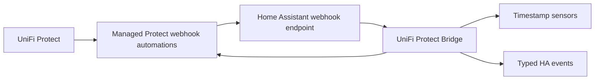

# UniFi Protect Bridge for Home Assistant

<p align="center">
  <a href="https://my.home-assistant.io/redirect/hacs_repository/?owner=Hovborg&repository=unifi-protect-bridge&category=integration">
    
  </a>
</p>

<p align="center">
  <a href="https://github.com/Hovborg/unifi-protect-bridge/releases/latest">
    
  </a>
  <a href="https://github.com/Hovborg/unifi-protect-bridge/actions/workflows/ci.yml">
    
  </a>
  <a href="https://github.com/Hovborg/unifi-protect-bridge/actions/workflows/hassfest.yml">
    
  </a>
  <a href="https://github.com/Hovborg/unifi-protect-bridge/actions/workflows/hacs.yml">
    
  </a>
</p>

<p align="center">
  
  
  
  
</p>

<p align="center">
  <strong>UniFi Protect to Home Assistant, without manual Alarm Manager rule sprawl.</strong>
</p>

<p align="center">
  UniFi Protect Bridge discovers your cameras, provisions the Protect webhook automations for you,
  and exposes clean detection sensors and typed events inside Home Assistant.
</p>

<p align="center">
  <a href="#why-this-project">Why</a> •
  <a href="#how-it-works">How It Works</a> •
  <a href="#install-with-hacs">Install</a> •
  <a href="#configure-it">Configure</a> •
  <a href="#supported-detections">Detections</a> •
  <a href="#troubleshooting">Troubleshooting</a> •
  <a href="#development">Development</a>
</p>

> [!TIP]
> If you want the shortest path, click **Open in HACS**, install the integration, restart Home Assistant, and add **UniFi Protect Bridge** from **Settings -> Devices & services**.

## Why This Project

UniFi Protect can already send webhook-based automations, but maintaining those rules by hand gets tedious fast when you have multiple cameras and multiple detection types. UniFi Protect Bridge turns that into a normal Home Assistant integration flow and keeps the Protect side aligned automatically.

| Auto-provisions Protect | Feels native in Home Assistant | Built for real debugging |
| --- | --- | --- |
| Creates and refreshes managed Protect webhook automations for supported detections. | HACS install, config flow, reconfigure, reauth, options flow, and services. | Supports Home Assistant diagnostics with credentials, host details, and webhook secrets redacted. |

## How It Works



After setup, the integration will:

- log in to Protect
- inspect cameras and their supported detections
- create or replace managed Protect automations when needed
- register a webhook endpoint in Home Assistant
- normalize incoming payloads into sensors and events

## Install With HACS

1. Open **HACS** in Home Assistant.
2. Open the top-right menu and select **Custom repositories**.
3. Add `https://github.com/Hovborg/unifi-protect-bridge`.
4. Choose category **Integration**.
5. Open **UniFi Protect Bridge** in HACS and click **Download**.
6. Restart Home Assistant.
7. Go to **Settings -> Devices & services -> Add Integration**.
8. Search for **UniFi Protect Bridge**.

> [!NOTE]
> If the integration does not show up after restart, refresh the browser and try again.

## Upgrade From Older Releases

Version `0.2.9` renames the integration domain from `ha_protect_bridge` to
`unifi_protect_bridge`.

For existing installations:

1. Remove the old **HA Protect Bridge** integration entry from Home Assistant.
2. Update the HACS repository URL to `https://github.com/Hovborg/unifi-protect-bridge`.
3. Restart Home Assistant.
4. Add **UniFi Protect Bridge** from **Settings -> Devices & services**.
5. Update automations that call old services or listen for old events.

Existing Protect-side automations with the old managed prefix are still recognized, so the
bridge can update them instead of creating duplicate Protect rules.

Home Assistant entity IDs may change after removing and adding the renamed integration.
Check dashboards, automations, scripts, and helpers for old `ha_protect_bridge` service,
event, or entity references after the upgrade.

## Configure It

When you add the integration, Home Assistant asks for:

- `Protect host`
- `Username`
- `Password`
- `Verify SSL certificate`
- `Webhook base URL override` if Protect cannot reach Home Assistant's normal URL

Once connected, Home Assistant will manage the Protect side for you.

You can later use:

- **Reconfigure** to change host, credentials, SSL choice, or webhook base URL
- **Reauthenticate** if credentials stop working
- **Options** to tune startup behavior

The most important option today is **Initial event backfill limit**:

- allowed range is `0` to `100`
- `0` disables event backfill entirely
- lower values reduce startup and resync load

If you need a stable low-load setup, start with `0` and increase later only if you actually want historical timestamps filled in at startup.

## What You Get

### On the Protect side

- one managed webhook automation per supported detection source
- automatic refresh when camera capabilities change
- consistent bridge-owned automation naming

### In Home Assistant

- one bridge status sensor
- one global timestamp sensor per managed detection type
- one per-camera timestamp sensor for every supported source that camera exposes
- typed HA events for every incoming detection
- services for inspection and resync

The integration registers these services:

- `unifi_protect_bridge.show_setup_info`
- `unifi_protect_bridge.resync`

Entity IDs depend on your NVR and camera names, but they look like this:

- `sensor.<nvr>_bridge_bridge_status`
- `sensor.<nvr>_bridge_last_person`
- `sensor.<camera>_last_ring`
- `sensor.<camera>_last_vehicle`

Every incoming webhook fires `unifi_protect_bridge_webhook`. Recognized detections also fire:

- `unifi_protect_bridge_detection`
- `unifi_protect_bridge_motion`
- `unifi_protect_bridge_person`
- `unifi_protect_bridge_vehicle`
- `unifi_protect_bridge_animal`
- `unifi_protect_bridge_package`
- `unifi_protect_bridge_license_plate_of_interest`
- `unifi_protect_bridge_ring`
- `unifi_protect_bridge_face_unknown`
- `unifi_protect_bridge_face_known`
- `unifi_protect_bridge_face_of_interest`
- `unifi_protect_bridge_audio_alarm_baby_cry`
- `unifi_protect_bridge_audio_alarm_bark`
- `unifi_protect_bridge_audio_alarm_burglar`
- `unifi_protect_bridge_audio_alarm_car_horn`
- `unifi_protect_bridge_audio_alarm_co`
- `unifi_protect_bridge_audio_alarm_glass_break`
- `unifi_protect_bridge_audio_alarm_siren`
- `unifi_protect_bridge_audio_alarm_smoke`
- `unifi_protect_bridge_audio_alarm_speak`

## Supported Detections

The current automatic coverage focuses on the normal Protect 7.x detection families.

| Group | Detection types |
| --- | --- |
| Core | `motion`, `person`, `vehicle`, `animal`, `package` |
| Doorbell | `ring` |
| Face | `face_unknown`, `face_known`, `face_of_interest` |
| License plate | `license_plate_of_interest` |
| Audio alarms | `audio_alarm_baby_cry`, `audio_alarm_bark`, `audio_alarm_burglar`, `audio_alarm_car_horn`, `audio_alarm_co`, `audio_alarm_glass_break`, `audio_alarm_siren`, `audio_alarm_smoke`, `audio_alarm_speak` |

## Troubleshooting

### Protect cannot reach Home Assistant

Set **Webhook base URL override** in the integration if Protect cannot call Home Assistant using the default generated URL.

### Home Assistant startup feels heavy

Open the integration **Options** and set **Initial event backfill limit** lower, or set it to `0` to disable startup backfill completely.

### You want a clean support dump

Use Home Assistant's normal **Download diagnostics** action on the config entry. The integration redacts:

- username
- password
- host
- webhook id
- webhook URL details

### You changed cameras or detection capabilities

Call:

- `unifi_protect_bridge.resync`

That will rebuild the catalog and refresh managed automations when needed.

## Manual Install

If you do not want to use HACS, copy `custom_components/unifi_protect_bridge` into your Home Assistant config directory so the final path is:

```text
config/custom_components/unifi_protect_bridge/
```

Then restart Home Assistant and add the integration from **Settings -> Devices & services**.

## HACS And GitHub Links

- HACS custom repository docs: <https://www.hacs.xyz/docs/faq/custom_repositories/>
- HACS download docs: <https://www.hacs.xyz/docs/use/download/download/>
- My Home Assistant HACS links: <https://www.hacs.xyz/docs/use/my/>
- Latest GitHub release: <https://github.com/Hovborg/unifi-protect-bridge/releases/latest>
- Issue tracker: <https://github.com/Hovborg/unifi-protect-bridge/issues>

## Technical Note

> [!IMPORTANT]
> Automatic provisioning uses UniFi Protect's private `/proxy/protect/api/automations` endpoint.
>
> That private API is what makes zero-manual setup possible, but it also means future Protect updates may require compatibility fixes in this integration.

## Optional CLI

The CLI is a developer and support tool for local checks, diagnostics, and dry
runs. HACS users do not need it to run the Home Assistant integration.

From a repository checkout:

```bash
source .venv/bin/activate
unifi-protect-bridge doctor
unifi-protect-bridge repo check
unifi-protect-bridge integration check
unifi-protect-bridge integration manifest
unifi-protect-bridge bridge sources
```

For offline Protect webhook and automation checks, save JSON first and pass it to
the CLI:

```bash
unifi-protect-bridge protect cameras --bootstrap protect-bootstrap.json
unifi-protect-bridge protect automations --file protect-automations.json
unifi-protect-bridge webhook normalize --file protect-webhook.json --query "source=person"
unifi-protect-bridge automation inspect --file protect-automations.json
unifi-protect-bridge automation render person --device "84:78:48:28:72:5C" --webhook-url "https://ha.example/api/webhook/redacted"
unifi-protect-bridge bridge plan --bootstrap protect-bootstrap.json --webhook-url "https://ha.example/api/webhook/redacted"
unifi-protect-bridge bridge plan person --device "84:78:48:28:72:5C" --webhook-url "https://ha.example/api/webhook/redacted"
```

The CLI does not change Protect automations by default. Setup-changing commands
must be added as explicit apply commands with confirmation and dry-run output
first.

For a live Home Assistant reachability check, set `HA_BASE_URL` and `HA_TOKEN`, then run:

```bash
unifi-protect-bridge ha ping
```

## Development

```bash
cd /path/to/unifi-protect-bridge
python3.14 -m venv .venv
source .venv/bin/activate
pip install -e ".[dev]"
ruff check .
pytest
```

For GitHub-specific maintainer tasks, prefer GitHub CLI (`gh`) over email or browser triage when available. In practice that means `gh run list`, `gh run view`, `gh workflow list`, `gh pr status`, and `gh api` for workflow and repository state inspection, while normal local repository work still uses plain `git`.
